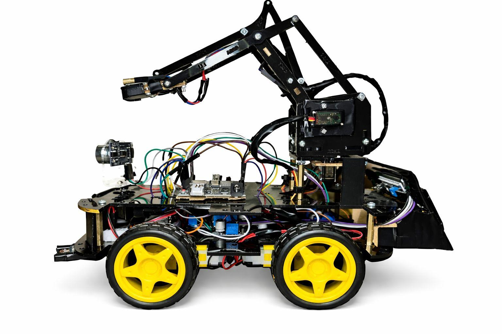
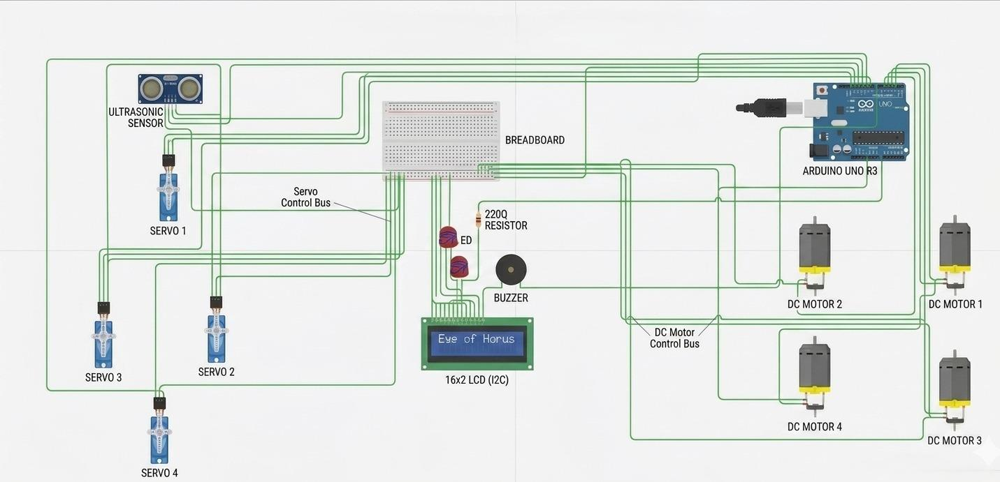
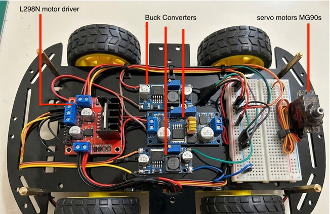
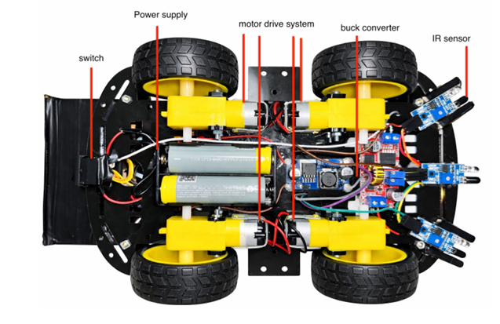

# 🚗 Vehicle-Mounted Radar & Laser Targeting System

<p align="center">

<strong>An Embedded Systems Graduation Project</strong>

</p>

<p align="center">


</p>

---

## 📌 Overview

The **Vehicle-Mounted Radar & Laser Targeting System** is an embedded systems project designed to combine **distance detection, servo positioning, motor control, and wireless communication** in a mobile robotic platform.

The system uses an **Arduino Uno** as the main controller and integrates multiple sensors and actuators to detect objects, control the vehicle's movement, and provide a targeting mechanism.

---

## 🎯 Project Objectives

The main objectives of the project are:

* Detect objects using an ultrasonic sensor.
* Scan the surrounding area using a servo motor.
* Control the movement of the mobile vehicle.
* Control DC motors through a motor driver.
* Provide wireless control using Bluetooth.
* Integrate multiple hardware components into one embedded system.
* Develop a practical application combining sensing, control, and automation.

---

## ⚙️ System Components

### 🔌 Main Hardware

| Component                     | Function                      |
| ----------------------------- | ----------------------------- |
| **Arduino Uno**               | Main microcontroller          |
| **HC-SR04 Ultrasonic Sensor** | Distance and object detection |
| **Servo Motor**               | Sensor scanning / positioning |
| **L298N Motor Driver**        | DC motor control              |
| **DC Motors**                 | Vehicle movement              |
| **Bluetooth Module**          | Wireless communication        |
| **Laser Module**              | Targeting indication          |

---

## 🧠 System Concept

The general operation of the system can be summarized as:

```text
              ┌─────────────────────┐
              │     Arduino Uno     │
              │   Main Controller   │
              └──────────┬──────────┘
                         │
          ┌──────────────┼──────────────┐
          │              │              │
          ▼              ▼              ▼
      HC-SR04          Servo         Bluetooth
   Distance Sensor    Scanning       Communication
          │              │              │
          └──────────────┼──────────────┘
                         │
                         ▼
                  Decision & Control
                         │
                    ┌────┴────┐
                    ▼         ▼
               L298N Driver  Laser
                    │       Targeting
                    ▼
                DC Motors
                    │
                    ▼
              Mobile Vehicle
```

---

## 💻 Software

The project software was developed for the Arduino platform using **C/C++**.

The code is responsible for:

* Reading distance measurements.
* Controlling the servo scanning mechanism.
* Processing sensor data.
* Controlling the DC motors.
* Handling Bluetooth commands.
* Managing the different operating modes of the system.
* Controlling the laser targeting mechanism.

---

## 🎮 Control System

The vehicle can be controlled through the Bluetooth communication system.

The Arduino receives commands wirelessly and translates them into movement or system-control instructions.

The control logic allows the system to manage functions such as:

```text
Forward
Backward
Left
Right
Stop
Manual / Automatic Control
```

---

## 📡 Detection & Scanning

The **HC-SR04 ultrasonic sensor** is mounted on a servo motor.

The servo allows the sensor to scan different angles and detect objects around the vehicle.

```text
             Object
               ▲
               │
               │ Ultrasonic Waves
               │
          ┌────┴────┐
          │ HC-SR04 │
          └────┬────┘
               │
             Servo
               │
               ▼
            Arduino
```

---

# 📂 Repository Structure

```text
Graduation-Project/
│
├── Code/
│   └── Arduino/
│
├── Documentation/
│   ├── project book.pdf
│   └── eye of horus Presentation.pdf
│
├── Images/
│   ├── Hardware/
│   │   ├── circiut.jpeg
│   │   ├── comp1.png
│   │   └── comp2.png
│   │
│   └── Final-Project/
│       └── final1.jpeg
│
├── Video/
│   └── project video.mp4
│
└── README.md
```

---

# 📸 Project Gallery

## 🚗 Final Project



---

## 🔧 Hardware

### Circuit



### Component 1



### Component 2



---

## 🔧 How to Run the Project

### 1. Requirements

* Arduino IDE
* Arduino Uno
* Required hardware components
* USB cable
* Bluetooth communication module

### 2. Upload the Code

Open the Arduino project from:

```text
Code/Arduino/
```

Then:

1. Open the `.ino` file using **Arduino IDE**.
2. Connect the Arduino Uno.
3. Select the correct board.
4. Select the correct COM port.
5. Upload the program.

### 3. Hardware Setup

Connect the components according to the project's circuit and wiring documentation.

---

## 📄 Documentation

### 📘 Project Report

The complete graduation project report is available here:

[📘 View Project Report](Documentation/project%20book.pdf)

### 🎞️ Project Presentation

The project presentation is available here:

[📘 View Project Presentation](Documentation/eye%20of%20horus%20Presentation.pdf)

---

## 🎥 Project Demonstration

The project demonstration video is available here:

[▶️ Watch Project Video](Videos/project%20video.mp4)

---

## 👥 Project Team

### Graduation Project Team

* **Ahmed Mostafa**
* **Amr Ayman**

---

## 🎓 Academic Information

**Department:** Electrical & Electronics Engineering

**University:** Ostim Technical University

**Project Type:** Graduation Project

---

## 📝 Notes

This repository contains the source code, documentation, images, presentation, and supporting materials related to the graduation project.

The project was developed as an academic engineering project with a focus on:

**Embedded Systems · Electronics · Sensing · Motor Control · Wireless Communication**

---

<div align="center">

## ⚡ Engineering Ideas Into Reality

</div>
